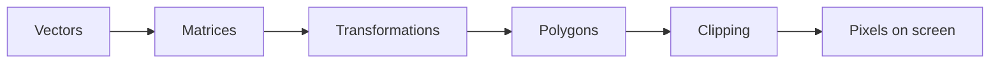
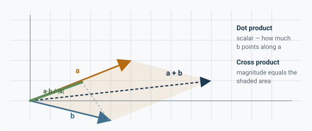
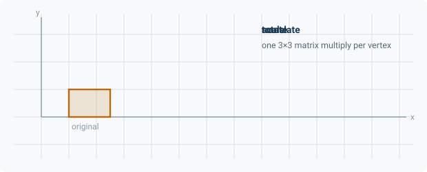
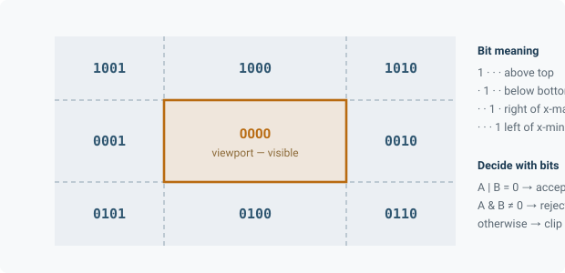

<div align="center">

# Computer Graphics

**A 2D/3D pipeline built from scratch — vectors, matrices, transformations, polygons, clipping.**

Lab work for the Computer Graphics course at the Technical University of Cluj-Napoca.


</div>

---

Every transformation, intersection and clip in this repository is computed by hand. No graphics library does the linear algebra — that is the entire point of the course.

<br>

## The five labs

| | Lab | What it builds |
|---|---|---|
| 1 | [Handling-Vectors](Handling-Vectors) | Addition, scaling, dot and cross products, normalisation |
| 2 | [Handling-Matrices](Handling-Matrices) | Multiplication, identity, inverse, composition |
| 3 | [2D_3D_Transformations](2D_3D_Transformations) | Translate, rotate, scale, shear via homogeneous coordinates |
| 4 | [Manipulating-polygons](Manipulating-polygons) | Vertex editing, filling, transforming closed shapes |
| 5 | [cohen-sutherland-clipping-algorithm](cohen-sutherland-clipping-algorithm) | Line clipping against a rectangular viewport |

They build on each other in that order. Lab 3 needs lab 2's matrix code; lab 5 needs both.



<br>

## What each lab actually does

<details open>
<summary><b>1 &nbsp;·&nbsp; Vectors — the two products that matter</b></summary>
<br>



The dot product answers *how much does b point along a* and returns a scalar. It is how you test whether a surface faces the camera, and how you compute diffuse lighting.

The cross product answers *what direction is perpendicular to both* and returns a vector whose magnitude equals the area of the parallelogram they span. It is how you compute surface normals and how you decide whether a polygon's vertices wind clockwise.

</details>

<details>
<summary><b>2 &nbsp;·&nbsp; Matrices — why transformations compose</b></summary>
<br>

A rotation followed by a translation followed by a scale is three separate operations applied to every vertex. Multiply the three matrices together first and it becomes one operation applied to every vertex.

For a 10,000-vertex mesh, that is 30,000 operations versus 10,000. The saving is why matrices are the representation graphics uses, rather than storing transforms as a list of steps.

Order matters, because matrix multiplication does not commute. Rotate-then-translate and translate-then-rotate put the shape in different places.

</details>

<details>
<summary><b>3 &nbsp;·&nbsp; Transformations — the homogeneous coordinate trick</b></summary>
<br>



Rotation and scaling are linear: each output coordinate is a weighted sum of the input coordinates, so both fit neatly into a 2×2 matrix. Translation is not — it adds a constant, which no 2×2 matrix can express.

The fix is to add a third coordinate, fixed at 1. In 3×3 form the constant lands in the last column, and translation becomes a matrix like any other:

```
│ 1  0  tx │   │ x │     │ x + tx │
│ 0  1  ty │ × │ y │  =  │ y + ty │
│ 0  0  1  │   │ 1 │     │   1    │
```

Now every transform is a matrix, so every transform composes. That one extra coordinate is what makes the whole pipeline uniform.

</details>

<details>
<summary><b>4 &nbsp;·&nbsp; Polygons — from points to filled shapes</b></summary>
<br>

A polygon is an ordered vertex list, and the order carries information: reverse it and the shape's winding flips, which is how back-face culling decides what to discard.

Filling means deciding which pixels lie inside. The scanline approach walks one horizontal row at a time, finds where that row crosses each edge, sorts the crossings, and fills between alternate pairs — which handles concave shapes correctly without any special case.

</details>

<details>
<summary><b>5 &nbsp;·&nbsp; Cohen–Sutherland — clipping without doing the maths</b></summary>
<br>

Each endpoint gets a 4-bit code recording which sides of the viewport it falls outside:



Two bitwise operations then settle most lines before any intersection is computed:



**OR both codes and get zero** — every bit is clear, so both endpoints are inside. Draw the line untouched.

**AND both codes and get non-zero** — some bit is set in both, so both endpoints lie beyond the same edge. The line cannot cross the window. Discard it.

**Neither** — one endpoint is outside. Compute where the line meets that edge, replace the endpoint, recompute its code, and test again. At most four iterations, because there are only four edges.

The elegance is that the expensive step only runs for lines that genuinely straddle a boundary. Most lines in a real scene are settled by two integer operations.

</details>

<br>

## Running

Each folder is a self-contained project. Open the one you want and build it.

> Replace this line with your toolchain — for example, open the `.sln` in Visual Studio and press <kbd>F5</kbd>.

<br>

## Repository

```
Computer-Graphics/
├── docs/                                 diagrams used by this README
├── Handling-Vectors/
├── Handling-Matrices/
├── 2D_3D_Transformations/
├── Manipulating-polygons/
└── cohen-sutherland-clipping-algorithm/
```

<br>

<div align="center">
<sub>Coursework, shared for reference. Learn from it rather than submit it.</sub>
</div>
